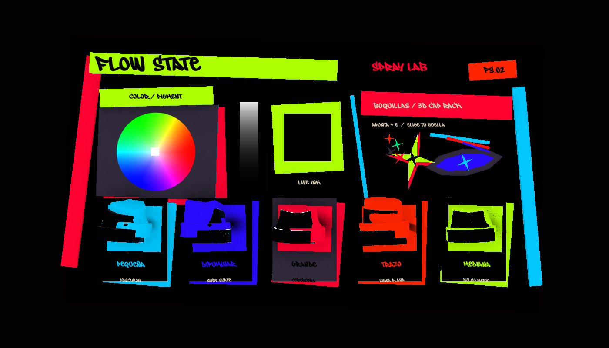
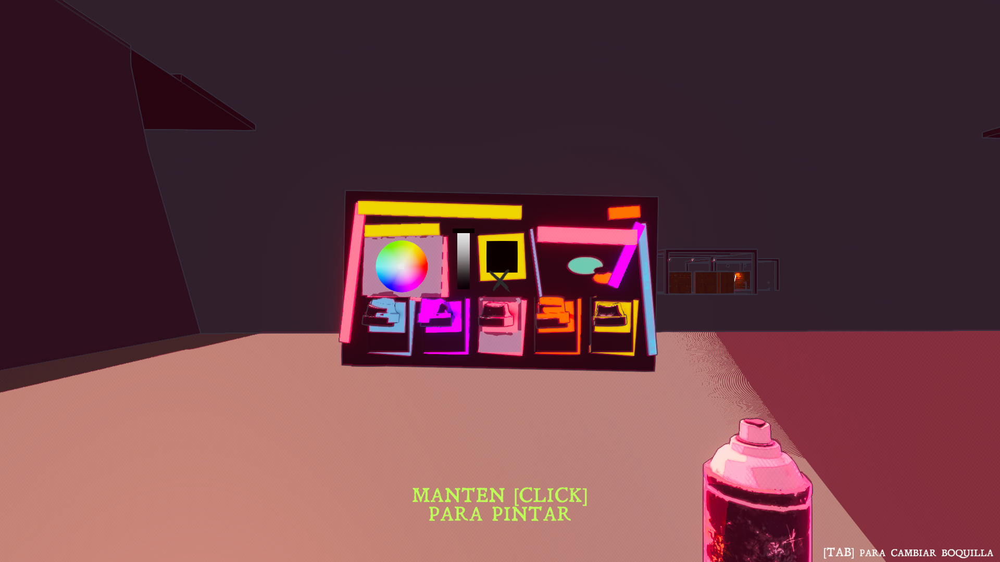

# FLOW STATE - Neo Spray Lab

Implemented 2026-09-23 in `Assets/03_Prefabs/DrawPaintMenu.prefab`.

## Art direction

The wall menu is treated as a physical street-editorial instrument rather than a flat settings panel. Its visual grammar combines black/plum ink, cut-paper geometry, acid yellow, cyan, magenta, orange, coral, mint and violet with the existing FLOW STATE graffiti typography.

The upper half is a color laboratory: pigment wheel, value/pressure rail and live color well. The lower half is a five-card 3D cap rack. Every card combines a physical nozzle silhouette, the existing spray footprint and a plain-language use label.

| Visible label | Imported source mesh | Existing paint role |
| --- | --- | --- |
| Pequeña | `tripo_part_0` (top-right) | Needle / fine line |
| Difuminar | `tripo_part_1` (top-left) | Soft / diffuse spray |
| Grande | `tripo_part_4` (bottom-right) | Fat Cap / large fill |
| Trazo | `tripo_part_2` (top-middle) | Chisel / directional line |
| Mediana | `tripo_part_3` (bottom-left) | Splatter / textured medium spray |

The meshes come directly from `Assets/03_Prefabs/boquillas.prefab`. Each is recentered and normalized visually without modifying that source prefab.

## Refinement pass

The second art-direction pass removes the overlapping blue side copy, bottom legend, registration bars and slider numerals. The color area now keeps only `COLOR / PIGMENT` on a dedicated acid tape above the wheel, leaving its interaction surface unobstructed.

The right-side decorative cluster was then rebuilt from the supplied reference language: a layered concave spark, a street-eye symbol, repeated micro-sparks and offset spray streaks replace the earlier ellipses and diagonal slab. These motifs are generated as reusable mesh assets so they remain crisp in the world-space menu.

## Interaction

`GraffitiNozzleVisual` is presentation-only. Existing hover calls lift and tilt the physical cap toward the player, brighten its card and increase depth. Selection adds a short punch response. Paint profile ownership remains in `GraffitiDrawnMenuButton` and `GraffitiPainter`.

## Regeneration and preview

Use these Unity menu items:

- `Flow State/Graffiti Menu/Build Neo Spray Lab`
- `Flow State/Graffiti Menu/Log Source Nozzle Layout`
- `Flow State/Graffiti Menu/Open Neo Spray Lab Prefab`
- `Flow State/Graffiti Menu/Capture Neo Spray Lab Preview`
- `Flow State/Graffiti Menu/Place Temporary Camera Preview`
- `Flow State/Graffiti Menu/Remove Temporary Camera Preview`

The builder is idempotent: it replaces only `ART_NEO_SPRAY_LAB` and each button's `ART_CAP` visual subtree. It does not rewrite nozzle sizes, opacity, paint rate, spacing, jitter, shape or source textures.

## Validation

- Unity imported and compiled the runtime/editor additions without project errors.
- All 7 EditMode tests passed.
- The PlayMode suite completed 19 tests; one settings migration test failed in the combined run and passed immediately when rerun alone, indicating order-dependent test state unrelated to this prefab.
- A field-by-field comparison against the original prefab confirmed all five paint profiles are identical.
- Visual review was performed through the active gameplay camera and the project's URP/FSSRS renderer.

