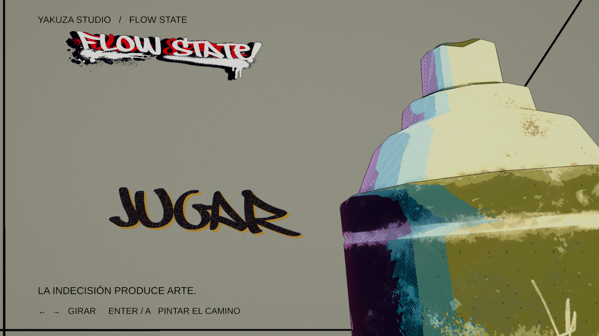

# FLOW STATE - Living Graffiti Main Menu

Implemented 2026-09-08 in `Assets/02_Escenas/MainMenu_FlowState.unity`.

## Playing and authoring

Open the scene and enter Play Mode. Keyboard arrows/A-D or gamepad stick/D-pad navigate circularly. Enter/gamepad south button or mouse click confirms; Escape/gamepad east button returns. Mouse wheel also navigates. The menu owns a clone of the existing `InputSystem_Actions` UI map; the original bindings and gameplay input are unchanged.

The menu is now first in Build Settings; the existing enabled `Game.unity` follows it. JUGAR paints across the lens and loads that scene asynchronously. GALERÍA displays three existing project artworks. CONFIG provides master volume, reduced motion and return. SALIR requires a second confirmation within five seconds; Escape cancels. In the Editor, confirmation logs the intended quit without closing Unity.

Edit the four ScriptableObjects under `Assets/09_MainMenu/Options` to change option/action, palette, emotion, pigment, grain/drips/halftone, turn and spray duration, audio clips/pitch, pressure, camera impulse and scene transition duration. UnityEvents provide an extension point for new actions. Submenus are intentionally a small foundation, not complete unlock, video-settings or rebinding systems.

The hero can uses a 2.3x presentation scale relative to the first implemented version, with its body extending below and beyond the right screen edge. Its nozzle remains visible. Edit `Can · inertia pivot` for framing and `CanMotion.turnCurve` for anticipation, overshoot and settle.

## Audit and reused assets

| Area | Existing project evidence | Integration |
| --- | --- | --- |
| Engine/pipeline | Unity 6000.0.41f1, URP 17.0.4, FSSRS renderer at index 1 | Existing renderer and stylized material shader, scene-local VolumeProfile |
| Official can | `Assets/LATA/Spray Test update.fbx` | Original prefab instance, imported orientation preserved and bounds normalized under a separate pivot |
| Can textures | BaseColor, Normal_OpenGL, Metallic, Roughness in `Assets/LATA` | Original base/normal maps on a menu-specific FSSRS material; source materials unchanged |
| Typography | `Assets/05_Tipografias/owned.ttf`, `owned SDF.asset` | OWNED raster stencils for all four painted labels; existing SDF for submenu headings |
| Branding | `Assets/04_Materiales e Imagenes/imagenes/YakuzaStudio_FLOWSTATE (1).png` | Original texture on a physical wall print |
| Emotion | `FlowStatePaletteController`, `FlowPaletteProfile`, `FlowStylizedLit.shader` | Existing palette interpolation and print lighting; MaterialPropertyBlock for local print/rim parameters |
| Graffiti | `Pintando`, `GraffitiSurfaceCanvas`, `GraffitiSprayStamp`, `DrawPaintMenu.prefab` | Existing system inspected: gameplay raycast/freehand stamps and a capped mesh. The menu needs whole-word raster consolidation, so uses an isolated fixed-size accumulator rather than duplicating the gameplay painter |
| Spray VFX | `GraffitiTools/Nozzle_SoftRound.png` | Existing nozzle texture on one bounded ParticleSystem |
| Audio | `Assets/08_Musica/Neon Dust.mp3` | Existing music; three new replaceable synthetic Foley clips because no can-specific clips were present |
| Transitions | `CameraTransition`, `CameraSwitcher` | Existing components serve player camera modes; new lens-paint scene transition has separate ownership |
| Scenes | Game, Game_LookDev_FSSRS, intro, Level | New menu scene; existing scenes preserved |

Emotion labels in the existing project differ from design language:

| Design state | Existing enum/profile |
| --- | --- |
| Flow State | CreativeFlow / FP_CreativeFlow |
| Ira | Anger / FP_Anger |
| Normal / Neutro | Clarity / FP_Clarity |
| Blanco y negro | Neutral / FP_Neutral_Unfinished |

The initial associations are editable assets, not runtime hardcoding. `Doubt` remains available as an additional existing palette. The only shared shader change replaces a monochrome `step` with `smoothstep`; original integer states retain their output, while fractional values can transition during menu turns.

## Ownership and bounded resources

- `MainMenuController`: authoritative selection, phases, bounded four-entry queue, confirmation and cancellation.
- `MenuInput`: private instance of the project's UI actions, subscriptions and hold-repeat.
- `CanMotion`, `CanVisualState`, `MenuCameraFeedback`: independent physical movement, existing FSSRS integration and restrained camera response.
- `GraffitiPlacement`: seeded continuous candidate scoring with decaying coverage; protects upper branding, lower legends and the can region. No visible grid or spawned slots.
- `GraffitiMenuPainter`: two 2048 x 1024 ARGB32 RenderTextures, ping-pong composition, one wall mesh. Approximately 16 MiB of color storage excluding driver overhead. Per-stroke object/material/RT counts do not grow.
- `MenuPaintComposite`: OWNED glyph in R, soft overspray in G, controlled drips in B. Progressive noisy reveal and pigment layering.
- `MenuWall`: baked pigment is displayed as dry history; current stencil is overlaid at full contrast without an extra RenderTexture. Wet sheen decays over time.
- `MenuSpray`, `MenuAudio`: one ParticleSystem capped at 128 particles; fixed metal, aerosol and music AudioSources.
- `MenuTransition`: persistent URP overlay camera, attached to both menu and destination camera stacks, then destroyed after the pigment clears.
- `MenuSubmenu`: small world-space gallery/config foundation.

The archive gradually erodes per new mark, keeping a long session from becoming an opaque mass. It does not grow an unbounded list of strokes. `MenuStroke` records option/rect/angle/seed for a future stroke-based save schema; the current save uses a flattened image.

## Persistence

`GraffitiMenuPainter.persistence` offers ResetOnEntry (default), Session, and BetweenSessions. Session keeps one bounded PNG in memory. BetweenSessions writes `flowstate-menu-wall-v1.png` under `Application.persistentDataPath`. Save occurs on leaving/disabling or application quit; repeated identical saves are skipped. Restore rejects oversized files and handles invalid images by resetting. The active option resets on scene entry; persisted paint is history.

`Tools/GenerateMainMenuAssets.py` regenerates the four OWNED masks and three synthetic Foley WAVs with Pillow and the Python standard library. It does not modify the official font/model/logo. `MainMenuBuilder` constructs and wires a new scene but intentionally refuses to overwrite an existing menu scene.

## Verification and limits

- Unity compilation and console inspected without feature errors.
- 7 EditMode tests passed, including the existing FSSRS tests and 10,000-placement composition checks.
- 5 PlayMode integration tests cover project-map keyboard/gamepad input, 1,000 rapid navigation requests, 300 paint operations with fixed object/texture counts, cancellation/reload, and painted transition to Game.unity.
- Visual review performed in 16:9, 4:3 and ultrawide, including the enlarged 2.3x can.
- No packaged Windows build, physical controller, extended real-device soak, or frame-time benchmark was performed. Bounded resource counts are measured; no FPS improvement is claimed.
- The model is one mesh, so the nozzle is an emission anchor rather than a separately animated mesh. Pressure feedback moves the can and emitter.
- Foley is synthesized and replaceable; a recorded Foley pass is still an artistic improvement opportunity.
- Persistence paths are implemented; cross-process persistence has not been separately tested. Settings changes use dedicated PlayerPrefs keys.
- Existing user changes in Game_LookDev_FSSRS, Leander SDF and OWNED assets were present before this work and preserved.
- TextMesh Pro populated its existing LiberationSans fallback atlas with the two navigation arrows (U+2190/U+2192). This generated font-cache change supports the menu legends. The test runner's temporary Enter Play Mode Options change was restored to its original value.

